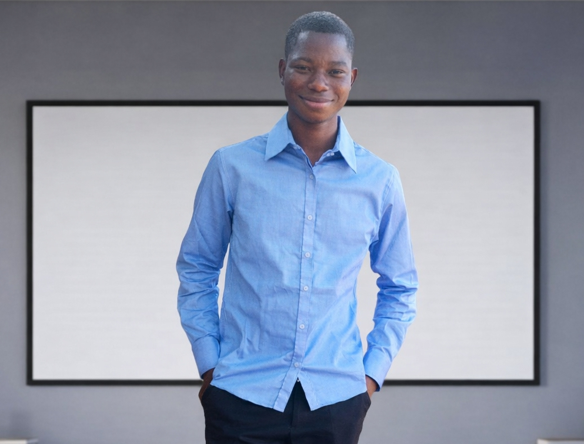
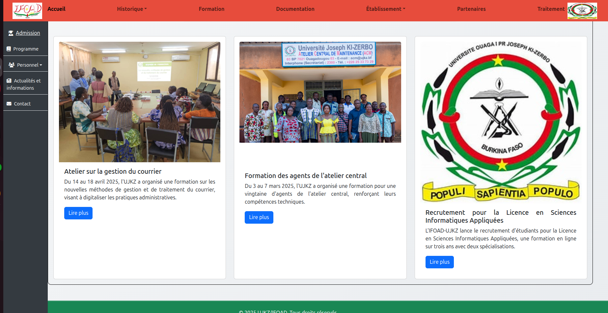

# 🌍 Portfolio - Yombisse (Softwave-MFANDEV)

[](https://developer.mozilla.org/fr/docs/Web/HTML)
[](https://getbootstrap.com/)
[](https://developer.mozilla.org/fr/docs/Web/JavaScript)
[](LICENSE)

> Portfolio professionnel d'un développeur fullstack basé à Ouagadougou, Burkina Faso.

---

## 📋 Description

Mon portfolio présente mes compétences en développement web et mobile, ainsi que les projets que j'ai réalisés. Il s'agit d'un site statique moderne, responsive et accessible, conçu pour mettre en valeur mon expertise technique et mes réalisations professionnelles.

**Développeur:** Yombisse (Softwave-MFANDEV)  
**Localisation:** Ouagadougou, Burkina Faso  
**Dernière mise à jour:** 2026

---

## 🛠️ Technologies Utilisées

| Technologie | Description | Niveau |
|-------------|-------------|--------|
| **HTML5** | Structure et sémantique du site | ✅ |
| **Bootstrap 5.3.0** | Framework CSS pour le design responsive | ✅ |
| **JavaScript (ES6+)** | Interactivité et validation côté client | ✅ |
| **CSS3** | Personnalisation du style | ✅ |

---

## ✨ Fonctionnalités

- 🎨 **Design moderne** - Interface utilisateur épurée et professionnelle
- 📱 **100% Responsive** - Compatible avec tous les appareils (mobile, tablette, desktop)
- 🖱️ **Navigation fluide** - Smooth scroll entre les sections
- ✨ **Animations** - Effets fade-in au défilement
- 📝 **Formulaire de contact** - Validation côté client avec messages d'erreur personnalisés
- ♿ **Accessible** - Respect des normes d'accessibilité web

---

## 📁 Structure du Projet

```
SoftwavePortifolio/
│
├── 📄 index.html              # Page principale du portfolio
├── 📄 readMe.md               # Documentation du projet
│
├── 📂 assets/
│   ├── 📂 css/
│   │   └── style.css          # Styles personnalisés
│   │
│   ├── 📂 images/
│   │   ├── Logo.png           # Logo principal
│   │   ├── logo.png           # Logo secondaire
│   │   ├── logo_icon.png      # Icône du logo
│   │   ├── profile.png        # Photo de profil
│   │   ├── plateformeifoad.png # Image projet IFOAD
│   │   └── section.jpg        # Image de section
│   │
│   └── 📂 js/
│       └── main.js            # Scripts JavaScript
│
└── 📂 .gitignore              # Fichiers ignorés par Git
```

---

## 🚀 Comment Exécuter le Projet

### Prérequis

- Un navigateur web moderne (Chrome, Firefox, Safari, Edge)
- Aucun serveur requis (site statique)

### Installation Locale

1. **Cloner le dépôt**

```bash
git clone https://github.com/yombisse/portfolio.git
```

2. **Naviguer dans le dossier**

```bash
cd SoftwavePortifolio
```

3. **Ouvrir le fichier HTML**

Simply open the `index.html` file in your preferred web browser:

```bash
# Sur Linux
xdg-open index.html

# Sur macOS
open index.html

# Sur Windows
start index.html
```

### Serveur Local (Optionnel)

Pour un meilleur développement, utilisez un serveur local:

```bash
# Avec Python
python -m http.server 8000

# Avec Node.js (http-server)
npx http-server
```

Puis accédez à `http://localhost:8000`

---

## 💼 Projets Presentés

### 1. Plateforme de Formation IFOAD

> Application web statique - Projet scolaire

Plateforme de formation en ligne développée lors de mon initiation aux technologies web statiques.

- **Technologies:** HTML, CSS, Bootstrap, JavaScript
- **Lien:** [Voir le projet](https://yombisse.github.io/Plateforme-de-formation-IFOAD/)
- **Code source:** [GitHub](https://github.com/yombisse/Plateforme-de-formation-IFOAD)

---

### 2. TrackFinance

> Application de gestion des associations et tontines

Application desktop complète pour la gestion des associations et tontines avec tableau de bord et statistiques intégrées.

- **Technologies:** Python
- **Fonctionnalités:**
  - Gestion des membres
  - Suivi des cotisations
  - Gestion des prêts et remboursements
  - Dashboard et statistiques
- **Code source:** [GitHub](https://github.com/yombisse/TrackFinance)

---

### 3. Studify

> Application mobile de gestion des étudiants

Application mobile cross-platform pour la gestion des étudiants avec backend API.

- **Frontend:** React-Native
- **Backend:** Node.js/Express
- **Base de données:** MySQL
- **Code source:** [GitHub](https://github.com/yombisse/Studify)

---

### 4. Gestionnaire de Pharmacie

> Application web de gestion Pharmacie Dofin Saamu

Système de gestion centralisée pour pharmacie avec Laravel et MySQL.

- **Technologies:** PHP, Laravel, JavaScript, MySQL
- **Code source:** [GitHub](https://github.com/yombisse/Gestion-Pharmacie)

---

## 🖼️ Aperçus

| Section Accueil | Section À propos | Section Projets |
|:---------------:|:----------------:|:---------------:|
|  |  |  |

> *Les aperçus seront ajoutés lors des prochaines mises à jour*

---

## 📬 Contact

Je suis disponible pour des opportunités de collaboration, des missions freelance ou des discussions techniques.

- 📧 **Email:** [yombisse@example.com](mailto:yombisse@example.com)
- 🔗 **LinkedIn:** [Profil LinkedIn](https://linkedin.com/in/yombisse)
- 🐙 **GitHub:** [github.com/yombisse](https://github.com/yombisse)
- 🌐 **Site web:** [yombisse.github.io](https://yombisse.github.io)

---

## 📝 License

Ce projet est sous licence MIT. Voir le fichier [LICENSE](LICENSE) pour plus de détails.

---

## 🙏 Remerciements

Merci de visit Mon portfolio ! N'hésitez pas à explorer mes projets et à me contacter pour toute collaboration.

---

*Développé avec ❤️ par Yombisse (Softwave-MFANDEV)*


